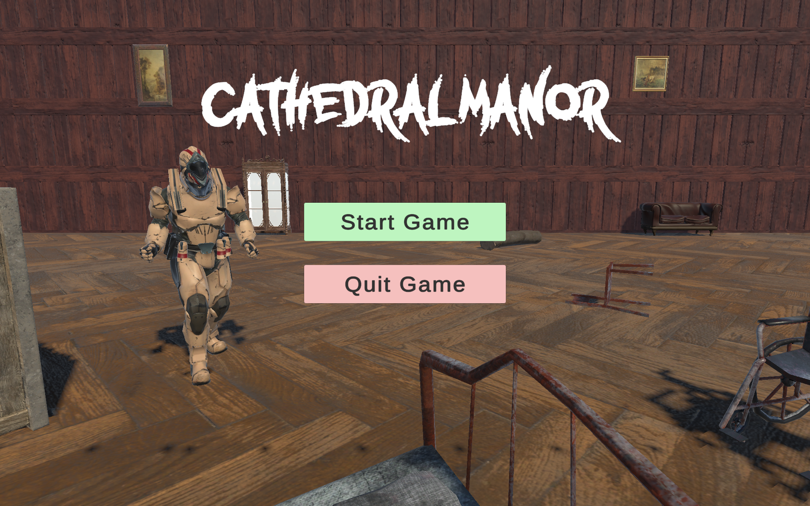
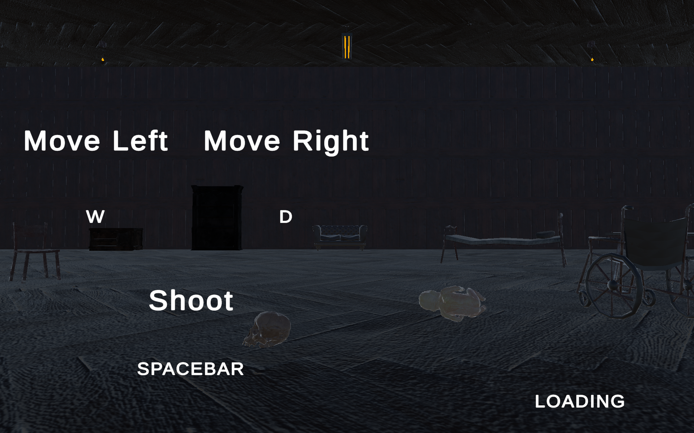
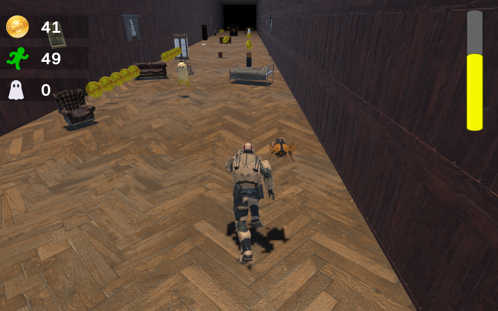
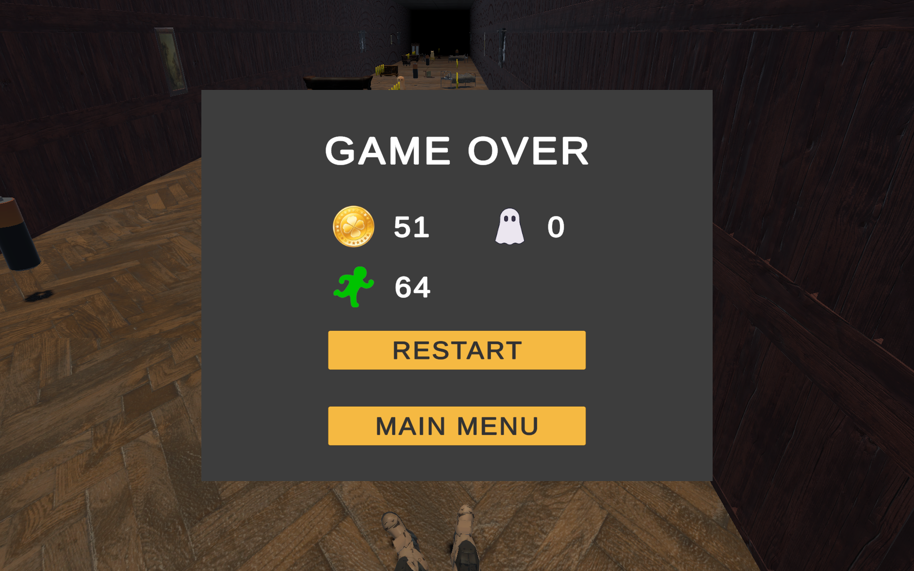

\# Cathedral Manor

Cathedral Manor is a mobile endless runner game developed using Unity for Android devices.

\## Game Overview

Players take control of a Ghostbuster trapped inside a haunted manor filled with ghosts and obstacles. The objective is to survive as long as possible, collect energy batteries, and eliminate ghosts using a laser weapon.

\## Features

\- Endless runner gameplay

\- Swipe left and right movement controls

\- Energy collection system

\- Laser shooting ability

\- Ghost enemy system

\- Haunted house environment

\- Mobile Android support

\## Controls

| Action | Control |

|---|---|

| Move Left | Swipe Left |

| Move Right | Swipe Right |

| Shoot Laser | Double Tap |

\## Gameplay Mechanics

\- Players collect batteries to fill the energy bar.

\- When the energy bar becomes full, players can double tap the screen to fire a laser.

\- Lasers can destroy ghosts instantly.

\- The game ends when the player collides with obstacles or enemies.

\## Screenshots

&#x20; 

&#x20; 

&#x20; 

&#x20; 

\## Built With

\- Unity 6

\- C#

\- Android Build Support

\## Release

Download the latest playable version from the \[Releases](../../releases/latest) page.

